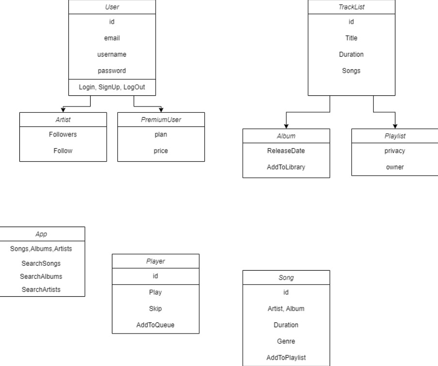

# Music Streaming Platform

## ETAPA 1

**Tema proiectului**: implementarea unei platforme de music streaming, adică să poți să te înregistrezi ca user sau ca artist, să adaugi melodii, să creezi playlisturi și implementarea unui player în care să poți crea o coada de melodii. Clasele folosite sunt: 

- **clasa User**: clasa pentru reprezentarea unei adrese a liceului sau pentru locul nasterii unei persoane
- **clasa Artist**: clasa din care mosteneste clasa Student
- **clasa PremiunUser**: clasa ce pastreaza datele despre studenti
- **clasa Song**: clasa ce cuprinde informatii despre liceul absolvit de student
- **clasa Tracklist**: clasa pentru reprezentarea materiilor si notelor unei student
- **clasa Playlist**: clasa pentru clasificarea studentilor din functie de domeniul de studiu
- **clasa Album**: clasa pentru repartizarea studentilor in formatiuni de studiu
- **clasa Player**: clasa pentru repartizarea studentilor in formatiuni de studiu
- **clasa App**: clasa pentru repartizarea studentilor in formatiuni de studiu



Pe langa acestea programul mai cuprinde si clasele:
- **clasele Service**: cuprinde toate functiile utile pentru realizarea comenzilor din meniu
- **clasa Main**: instantiaza un meniu si ruleaza programul principal al aplicatiei

### *Functiile aplicatiei:*
```[python]
-----------------------------------
getById()
getByName()
deleteById()
deleteByName()
read()
update()
add()
songOrd()
addSongToPlaylist()
print()
-----------------------------------
```
